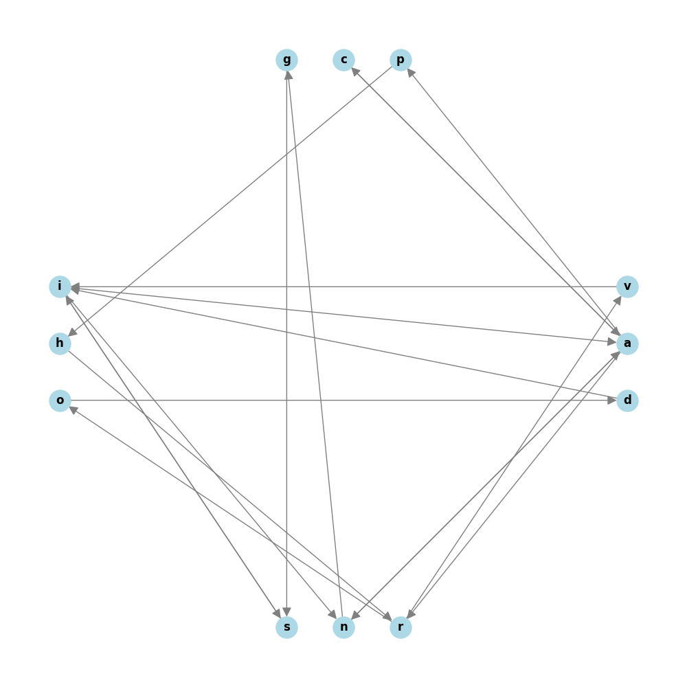

# NYT Games Solver

A Python tool that solves New York Times word games, with plans for a full web UI.



## Current Features

- ✅ **Spelling Bee** solver
- ✅ **Letter Boxed** solver
- ✅ Results grouped by word length
- ✅ Extensive English word dictionary

## Roadmap

### Phase 1: Additional Games
- [ ] **Wordle** - 5-letter word guessing with feedback optimization
- [ ] **Connections** - Group 16 words into 4 categories
- [ ] **Strands** - Theme-based word search

### Phase 2: Web UI
- [ ] React/Next.js frontend
- [ ] Interactive puzzle input
- [ ] Visual solution display
- [ ] Daily puzzle auto-fetch
- [ ] Solution history/stats

### Phase 3: Enhancements
- [ ] Better word corpus (closer to NYT's dictionary)
- [ ] Solver strategy explanations
- [ ] Mobile-responsive design
- [ ] PWA support

## Installation

1. Clone the repository:
```bash
git clone https://github.com/jackswitzer/NYT-Games.git
cd NYT-Games
```

2. Create and activate a virtual environment:
```bash
python -m venv venv
source venv/bin/activate  # On Windows: venv\Scripts\activate
```

3. Install dependencies:
```bash
pip install -r requirements.txt
```

## Usage

### Spelling Bee

1. Create a JSON configuration file in `Data/GameData/SB/Daily/`:
```json
{
    "mandatory_char": "o",
    "optional_chars": "tirmfy"
}
```

2. Run the solver:
```bash
python main.py SB
```

### Letter Boxed

1. Create a JSON configuration file in `Data/GameData/LB/Daily/`:
```json
{
    "sides": ["abc", "def", "ghi", "jkl"]
}
```

2. Run the solver:
```bash
python main.py LB
```

## Game Rules

### Spelling Bee
- Words must contain the central (mandatory) letter
- Words must be 4+ letters long
- Can only use provided letters
- Letters can be reused

### Letter Boxed
- Letters must be connected by lines
- Consecutive letters cannot come from the same side
- Letters can be reused
- Words must be 3+ letters long

## Contributing

Contributions welcome! See the roadmap above for planned features.

## License

MIT
